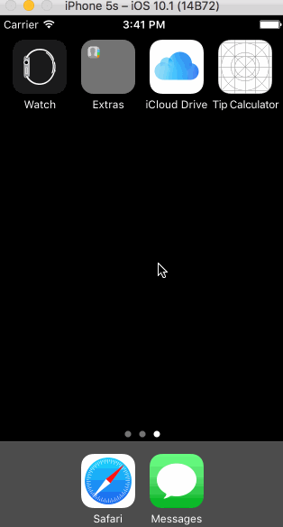

# **CodePathU Pre-Work Tip Calculator**

tipCalc is a tip calculator application for iOS.

Submitted by: Dustyn Buchanan

Time spent: 20 hours in total

## The following REQUIRED  functionality is complete:
[x] User can enter a bill amount, choose a tip percentage, and see the tip and total values.

## The following OPTIONAL features are implemented:
[x] Settings page to change the default tip percentage. 
 [x] Making sure the keyboard is always visible and the bill amount is always the first responder. This way the user doesn't have to tap anywhere to use this app. Just launch the app and start typing.

## The following ADDITIONAL features are implemented:
[x] Added swipe gestures to let users to swipe back and forth between the main page and the settings page.
 [x] Changed the theme and colors of the app 
 [x] The user may now select between Light and Dark Themes.

## Here's a walkthrough of implemented user stories:

GIF created with [LiceCap](http://www.cockos.com/licecap/).

